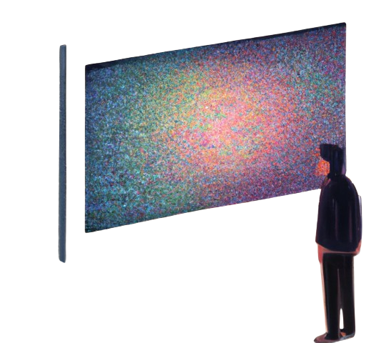

 

# PROJCT NAME: `PresenterCanvasOverlay`
>  **PROJECT DESCRIPTION:**
>**`The project aims to develop a real-time camera application that utilizes MediaPipe, an open-source framework by Google, to analyze and annotate live camera feed data. The application utilizes the MediaPipe Holistic model to perform real-time holistic analysis, including facial, hand, and body pose recognition.`**

## CONTENT:
1. [Key Features](#key-features)
2. [Potential Use Cases](#potential-use-cases)
3. [Project Implementation](#project-implementation)
4. [Target Audience](#target-audience)
5. [Guides](#guides)

## Key Features:

1. **Live Camera Feed Analysis:** The application captures live video feed from the camera and processes it in real-time using the MediaPipe Holistic model.

2. **Holistic Analysis:** MediaPipe's Holistic model is employed to perform comprehensive analysis of each frame, including facial landmark detection, hand tracking, and full-body pose estimation.

3. **Real-time Annotation:** The detected facial landmarks, hand landmarks, and body pose are annotated directly onto the live camera feed in real-time, providing users with immediate visual feedback.

4. **Interactive Applications:** The annotated data can be used to develop interactive applications, such as virtual try-on experiences, augmented reality filters, fitness tracking, and gesture-based control systems.

5. **Customizable Applications:** The application provides a flexible platform for developers to create customized solutions by leveraging the rich data provided by the MediaPipe Holistic model.

## Potential Use Cases:

- **Virtual Try-On:** Users can try on virtual accessories, such as glasses, hats, or jewelry, and see how they look in real-time.
  
- **Augmented Reality Filters:** Filters can be applied to the user's face in real-time, allowing for fun and interactive experiences, similar to popular social media platforms.
  
- **Fitness Tracking:** Body pose estimation can be used to track and analyze the user's movements during workouts, providing real-time feedback and performance metrics.
  
- **Gesture-Based Control:** Hand tracking can enable gesture-based control systems for interacting with virtual environments, games, or applications.

## Project Implementation:

The application will be developed using Python programming language, utilizing MediaPipe's Python API for real-time analysis of camera feed data. OpenCV will be used for camera access and video processing. The application will be designed to be modular and extensible, allowing for easy integration of additional features and customizations.

## Target Audience:

The target audience includes developers, researchers, and enthusiasts interested in computer vision, augmented reality, and interactive applications. The project provides a valuable resource for learning, experimentation, and innovation in these fields.

## Guides:

1. ##### Setup Guide [[Here](./docs/guides/markdowns/projectSetup.md)].
2. ##### Read Project Structure Guide. [[Here](docs\guides\markdowns\dirStructure.md)]